# 🎼 Bach AI: Deep Polyphonic Music Generation with Hybrid Dilated CNN-LSTM Networks

[](https://www.python.org/)
[](https://tensorflow.org/)
[](LICENSE)
[](#-how-it-works-core-logic)

A state-of-the-art deep learning system designed to generate **4-voice polyphonic classical chorales in the style of Johann Sebastian Bach**. By combining **dilated causal 1D convolutions** with **Long Short-Term Memory (LSTM)** recurrent networks and temperature-controlled stochastic sampling, this project models complex temporal harmonic progressions and synthesizes them directly into playable audio waveforms (`.wav`).

---

## 🚀 Project Title & Overview

**Bach AI** processes multi-track MIDI-encoded chorales from the benchmark **JSB Chorales Dataset**. It treats 4-part polyphonic harmonies (Soprano, Alto, Tenor, Bass) as flattened sequential arpeggios, learning both immediate voice-leading constraints and global temporal structures.

### Key Capabilities
- 🎹 **Polyphonic Representation**: Encodes 4-part chordal structures into flattened sequential streams while retaining pitch relationships.
- ⚡ **Dilated Receptive Fields**: Uses 1D Causal Convolutions with exponentially growing dilation rates ($d \in \{1, 2, 4, 8\}$) to capture local rhythmic motifs without future context leakage.
- 🧠 **LSTM Recurrent Memory**: Employs a 256-unit LSTM layer to maintain long-range harmonic context across musical measures.
- 🎛️ **Temperature-Controlled Autoregressive Sampling**: Generates novel compositions with configurable creativity levels ($T = 0.8$ cold, $1.0$ medium, $1.5$ hot).
- 🔊 **Mathematical Waveform Synthesis**: Built-in DSP engine converts synthesized MIDI pitch sequences directly into multi-voice sine wave audio with click-reduction phase alignment and quadratic fade-out.

---

## 🏗️ Architecture & Flow Scheme

```mermaid
graph TD
    %% Dataset & Pipeline Stage
    subgraph Data_Pipeline["1. Data Ingestion & Preprocessing Pipeline"]
        A["📄 JSB Chorales CSV Files<br/>(4 Voice MIDI Tracks: S, A, T, B)"] --> B["⚙️ Note Normalization & Index Shifting<br/>(min_note = 36 Shift & Flatten to Arpeggio)"]
        B --> C["🪟 tf.data Windowing & Slicing<br/>(Window Size=33, Shift=16)"]
        C --> D["🔀 Batching, Shuffling & Target Slicing<br/>(X: [:-1], Y: [1:])"]
    end

    %% Deep Learning Neural Network
    subgraph Deep_Learning_Model["2. Hybrid Dilated CNN-LSTM Network"]
        D --> E["🔤 Pitch Embedding Layer<br/>(input_dim=47, output_dim=5)"]
        E --> F1["🌊 Conv1D (32 filters, rate=1, causal)"]
        F1 --> BN1["🧮 Batch Normalization"]
        BN1 --> F2["🌊 Conv1D (48 filters, rate=2, causal)"]
        F2 --> BN2["🧮 Batch Normalization"]
        BN2 --> F3["🌊 Conv1D (64 filters, rate=4, causal)"]
        F3 --> BN3["🧮 Batch Normalization"]
        BN3 --> F4["🌊 Conv1D (96 filters, rate=8, causal)"]
        F4 --> BN4["🧮 Batch Normalization"]
        BN4 --> G["🧠 Recurrent LSTM Layer<br/>(256 units, return_sequences=True)"]
        G --> H["✂️ Dropout Layer (rate=0.2)"]
        H --> I["🎯 Softmax Dense Classifier<br/>(n_notes=47 output probabilities)"]
    end

    %% Inference & Synthesis Stage
    subgraph Generation_Synthesis["3. Autoregressive Generation & Audio DSP Engine"]
        I --> J["🎲 Temperature Sampling<br/>(Greedy Argmax or Rescaled Logits Categorical)"]
        J --> K["🔁 Autoregressive Loop<br/>(Note-by-Note Sequence Extension)"]
        K --> L["🎵 MIDI Pitch to Frequency Conversion<br/>(f = 440 * 2^((note-69)/12))"]
        L --> M["🔊 Multi-Voice Waveform Synthesizer<br/>(Phase-Aligned Sine Waves & Fade-Out)"]
        M --> N["💾 Audio WAV Output Exporter<br/>(.wav File Generation & Audio Playback)"]
    end
```



---

## 📂 Directory Structure

```text
Bach_with_RNN_CNN/
│
├── 📄 README.md                        # Project documentation & visual guide
├── 📄 requirements.txt                 # Core environment dependencies
├── 📜 utils.py                         # Data pipeline, audio DSP & inference helper functions
├── 📓 main.ipynb                       # Full workflow notebook: EDA, training, & composition
│
├── 📁 data/                            # Raw and extracted chorale datasets
│   ├── 📦 jsb_chorales.tgz             # Compressed dataset archive
│   ├── 📁 datasets/                    # Extracted JSB datasets cache
│   └── 📁 jsb_chorales/                # Processed splits
│       ├── 📁 train/                   # Training set CSV chorales
│       ├── 📁 valid/                   # Validation set CSV chorales
│       └── 📁 test/                    # Test set CSV chorales
│
├── 📁 models/                          # Trained Keras model checkpoints
│   └── 💾 my_bach_model.keras          # Saved hybrid CNN-LSTM Keras model file
│
└── 🎵 Generated & Test Audio Files:
    ├── 🎧 bach_cold.wav                # Generated chorale with Low Temperature (T = 0.8)
    ├── 🎧 bach_medium.wav              # Generated chorale with Normal Temperature (T = 1.0)
    ├── 🎧 bach_hot.wav                 # Generated chorale with High Temperature (T = 1.5)
    └── 🎧 bach_test_4.wav              # Ground-truth test set chorale baseline
```

---

## 📄 File Details

Below is a detailed breakdown of each file and component in the repository:

* [main.ipynb](file:///Users/wess/Desktop/Bach_with_RNN_CNN/main.ipynb): The primary execution notebook. Drives data downloading, dataset preprocessing, hybrid CNN-LSTM neural network construction, Nadam optimization training, evaluation, and interactive audio generation experiments.
* [utils.py](file:///Users/wess/Desktop/Bach_with_RNN_CNN/utils.py): Core modular python module containing:
  * Data loader & pipeline transformers ([`load_data`](file:///Users/wess/Desktop/Bach_with_RNN_CNN/utils.py#L14), [`bach_dataset`](file:///Users/wess/Desktop/Bach_with_RNN_CNN/utils.py#L36), [`preprocess`](file:///Users/wess/Desktop/Bach_with_RNN_CNN/utils.py#L32)).
  * Autoregressive sequence generators ([`generate_chorale`](file:///Users/wess/Desktop/Bach_with_RNN_CNN/utils.py#L105), [`generate_chorale_v2`](file:///Users/wess/Desktop/Bach_with_RNN_CNN/utils.py#L115)).
  * DSP digital audio synthesis suite ([`notes_to_frequencies`](file:///Users/wess/Desktop/Bach_with_RNN_CNN/utils.py#L67), [`frequencies_to_samples`](file:///Users/wess/Desktop/Bach_with_RNN_CNN/utils.py#L72), [`chords_to_samples`](file:///Users/wess/Desktop/Bach_with_RNN_CNN/utils.py#L84), [`play_chords`](file:///Users/wess/Desktop/Bach_with_RNN_CNN/utils.py#L94)).
* [models/my_bach_model.keras](file:///Users/wess/Desktop/Bach_with_RNN_CNN/models/my_bach_model.keras): Serialized TensorFlow Keras model storing trained weights and architecture parameters after 25 training epochs.
* [requirements.txt](file:///Users/wess/Desktop/Bach_with_RNN_CNN/requirements.txt): Environment configuration file specifying dependencies such as TensorFlow and numerical computing libraries.
* [data/](file:///Users/wess/Desktop/Bach_with_RNN_CNN/data): Directory containing the **JSB Chorales** dataset splits formatted as CSV files (where each row contains 4 MIDI note numbers corresponding to Soprano, Alto, Tenor, and Bass voices).
* Audio Exporter Artifacts:
  * [bach_cold.wav](file:///Users/wess/Desktop/Bach_with_RNN_CNN/bach_cold.wav): Audio output generated with temperature $T=0.8$ (conservative, harmonically strict).
  * [bach_medium.wav](file:///Users/wess/Desktop/Bach_with_RNN_CNN/bach_medium.wav): Audio output generated with temperature $T=1.0$ (balanced classical balance).
  * [bach_hot.wav](file:///Users/wess/Desktop/Bach_with_RNN_CNN/bach_hot.wav): Audio output generated with temperature $T=1.5$ (creative, adventurous variations).
  * [bach_test_4.wav](file:///Users/wess/Desktop/Bach_with_RNN_CNN/bach_test_4.wav): Synthesized ground-truth baseline from the JSB test partition.

---

## 🧮 How It Works (Core Logic & Mathematics)

### 1. Data Representation & Shift Algebra
Musical notes in JSB Chorales are encoded as MIDI pitch integers $n \in [36, 81]$. Value `0` represents silence/rest. To optimize embedding efficiency, values are mapped zero-relative to the minimum active pitch ($\text{min\_note} = 36$):

$$\text{Shifted Pitch } \tilde{n} = \begin{cases} 0 & \text{if } n = 0 \\ n - \text{min\_note} + 1 & \text{if } n > 0 \end{cases}$$

This maps active notes into a compact vocabulary size $N = 47$. Four-part chorale chords are flattened into sequential 1D arpeggiated streams $[S_t, A_t, T_t, B_t, S_{t+1}, \dots]$, allowing autoregressive next-note prediction across voice steps.

### 2. Dilated Causal Convolutions
To expand the receptive field without exponential parameter growth or temporal feedback leakage, the network utilizes 1D causal convolutions with doubling dilation factors $d \in \{1, 2, 4, 8\}$:

$$(y *_{d} k)(t) = \sum_{m=0}^{K-1} k(m) \cdot x(t - d \cdot m)$$

This exponential dilation growth ensures that the network inspects multi-measure rhythmic context before passing temporal representations to the 256-unit **LSTM** layer.

```
Dilation Rate = 8 :  o---------------o
Dilation Rate = 4 :  o-------o-------o
Dilation Rate = 2 :  o---o---o---o---o
Dilation Rate = 1 :  o-o-o-o-o-o-o-o-o
```

### 3. Temperature-Scaled Stochastic Sampling
During generation, logits $z_k$ produced by the final Softmax dense layer are adjusted using a temperature parameter $T > 0$:

$$P(y_t = k \mid y_{<t}) = \frac{\exp(z_k / T)}{\sum_{j=1}^{N} \exp(z_j / T)}$$

* **Cold Sampling ($T < 1.0$)**: Sharpens probability distributions; produces structured, traditional voice leading.
* **Hot Sampling ($T > 1.0$)**: Flattens probability distributions; introduces higher chromatic variation and creative experimentation.

### 4. Waveform Audio Synthesis
The synthesized MIDI pitch numbers are converted to physical frequencies $f$ in Hertz (Hz):

$$f = 440 \times 2^{\frac{n - 69}{12}}$$

Sine wave audio vectors $x_v(t)$ are computed per voice $v \in \{S, A, T, B\}$ over duration $D = \frac{60}{\text{Tempo}}$, phase-rounded at beat boundaries to eliminate zero-crossing clicks:

$$x_v(t) = \sin(2\pi \cdot f_v \cdot t) \cdot \mathbb{I}(f_v > 9\text{ Hz})$$

The 4 voices are merged by averaging $X_{\text{chorale}}(t) = \frac{1}{4} \sum_{v=1}^4 x_v(t)$, and a quadratic fade-out $w(t) = \left(1 - \frac{t}{T_{\text{fade}}}\right)^2$ is applied to the final chord.

---

## 🛠️ Setup & Requirements

### Prerequisites
* Python 3.9+
* macOS, Linux, or Windows

### Step-by-Step Installation

1. **Clone the Repository & Navigate to Workspace**:
   ```bash
   cd /Users/wess/Desktop/Bach_with_RNN_CNN
   ```

2. **Set Up Virtual Environment**:
   ```bash
   python3 -m venv .venv
   source .venv/bin/activate
   ```

3. **Install Dependencies**:
   ```bash
   pip install --upgrade pip
   pip install tensorflow pandas numpy scipy ipython notebook
   ```

4. **Verify Environment Setup**:
   ```bash
   python3 -c "import tensorflow as tf; print('TensorFlow Version:', tf.__version__)"
   ```

---

## 🎮 Controls / Usage

### Running the Project Workflow

1. **Launch Jupyter Notebook**:
   ```bash
   jupyter notebook main.ipynb
   ```

2. **Train the Model**:
   Execute Cell 9 through Cell 11 in [main.ipynb](file:///Users/wess/Desktop/Bach_with_RNN_CNN/main.ipynb) to build the model, fit it using the `Nadam` optimizer over 25 epochs, and save the weights to `models/my_bach_model.keras`.

3. **Generating New Bach Chorales**:
   Import inference utilities from [`utils.py`](file:///Users/wess/Desktop/Bach_with_RNN_CNN/utils.py) and pass a seed sequence:

   ```python
   from utils import generate_chorale_v2, play_chords
   import tensorflow as tf

   # Load pre-trained model
   model = tf.keras.models.load_model("models/my_bach_model.keras")

   # Extract seed chords from test set (e.g. first 8 chords)
   seed = test_chorales[0][:8]

   # Generate 56 novel 4-voice chords with medium temperature
   new_composition = generate_chorale_v2(model, seed_chords=seed, length=56, temperature=1.0)

   # Synthesize audio and export to WAV
   play_chords(new_composition, tempo=160, filepath="my_new_bach_chorale.wav")
   ```

### Audio Generation Temperature Tuning Guide

| Temperature ($T$) | Mode | Characteristic | Best For |
| :--- | :--- | :--- | :--- |
| **$T = 0.8$** | Cold ❄️ | Conservative, strict harmonic adherence, predictable cadence | Formal classical counterpoint |
| **$T = 1.0$** | Medium 🎼 | Balanced classical Bach counterpoint with natural variation | Standard music composition |
| **$T = 1.5$** | Hot 🔥 | Adventurous, highly chromatic, unpredictable voice movements | Creative jazz/experimental fusion |

---

<p center="align">
  <i>Developed with ❤️ using TensorFlow, Keras, & Scientific Python.</i>
</p>
